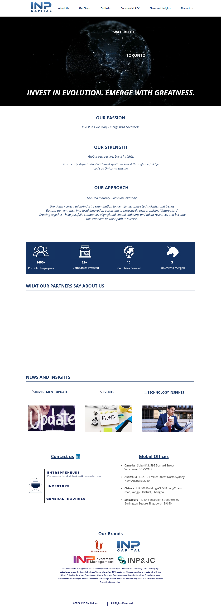

# Deep Dive: https://www.inp-capital.com

## INP Capital: A Deep Dive into Emerging Unicorn Hunters

**1. The Hook:**

INP Capital is an investment firm laser-focused on identifying and nurturing future Unicorns, specifically in the "sweet spot" between early stage and pre-IPO. They're not just throwing money at the wall; they're aiming for precision investing, leveraging global perspective with local ecosystem insights. This firm is interesting because it aims to bridge the gap between global capital and local innovation, a potentially powerful combination in today's fragmented yet interconnected tech landscape.

**2. Value Prop:**

INP Capital solves the problem of access – access for investors to high-growth potential startups in emerging ecosystems, and access for startups to the global capital, industry expertise, and talent they need to scale rapidly. They position themselves as "enablers" on the path to success, suggesting a more hands-on, value-added approach than simply providing funding.

**3. Mechanism:**

While the details are high-level, INP Capital’s approach appears to be based on a dual strategy:

*   **Top-Down:** Identifying disruptive technologies and trends across regions and industries. This suggests a strong research capability and a proactive approach to sector selection.
*   **Bottom-Up:** Entrenching themselves within local innovation ecosystems to proactively seek out promising "future stars." This implies a network of scouts and advisors who can identify early-stage companies with significant potential.
*   **Growth-Oriented:** Helping portfolio companies align with global capital, industry, and talent resources. This could involve providing operational support, mentorship, and connections to potential partners and customers.

The firm's global presence, with offices in Canada, Australia, China, and Singapore, facilitates both top-down trend identification and bottom-up sourcing of promising startups.

**4. Bull Case:**

The bull case for INP Capital rests on their ability to consistently identify and support winning companies. If they can continue to cultivate and guide startups to Unicorn status, as evidenced by their claim of having already "emerged" 3, they could generate significant returns for their investors. The focus on the "sweet spot" suggests a derisked strategy, and they might be able to achieve superior returns compared to those focused purely on venture or growth-stage investing. Additionally, the global perspective provides an edge, as they can tap into emerging markets and technologies that may be overlooked by more regionally focused firms. ApplyBoard CEO's quote demonstrates positive signals of effective execution in enabling company growth. If INP Capital can continue to repeat this process, it may lead to the firm growing into a well-regarded investment brand.

**5. Bear Case:**

The bear case centers on the inherent risks of early-stage investing and the challenges of scaling a global operation. Identifying true Unicorns is incredibly difficult, and the vast majority of startups fail.

*   **Deal Flow & Selection:** While the global presence is a strength, it could also dilute their focus and lead to suboptimal investment decisions if not managed effectively.
*   **Operational Challenges:** Supporting portfolio companies across multiple geographies requires significant resources and expertise. Cultural differences and logistical complexities could hinder their ability to provide meaningful value.
*   **Market Volatility:** Economic downturns and shifts in investor sentiment could negatively impact the valuations of their portfolio companies, particularly those nearing the pre-IPO stage.
*   **Competition:** The venture capital and growth equity landscape is highly competitive. INP Capital will need to differentiate itself to attract both promising startups and discerning investors.
*   **Small Sample Size:** Having "emerged" 3 Unicorns is good, but it's a small sample size to draw definitive conclusions about their long-term investment prowess.

Overall, INP Capital presents an interesting opportunity for investors seeking exposure to high-growth potential startups in emerging ecosystems. However, as with any investment in this space, significant due diligence is required to assess their ability to navigate the inherent risks and deliver on their promise.
