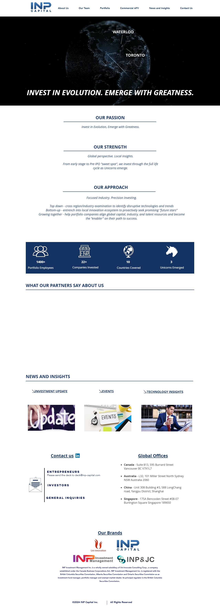

# Deep Dive: https://www.inp-capital.com

## INP Capital: Deep Dive - Global Vision, Local Execution in the Unicorn Factory

**1. The Hook:** INP Capital is a global venture capital firm laser-focused on identifying and nurturing future unicorns. They bridge the gap between early-stage innovation and pre-IPO readiness, operating across continents to tap into the next wave of disruptive technologies. Think of them as global scouts with local roots, aiming to be the "enabler" on a startup's path to greatness.

**2. Value Prop:** In a world awash with capital, INP Capital offers more than just money. They solve the critical challenge of scaling globally, particularly for companies navigating complex international markets. They provide access to capital, industry expertise, and talent networks, helping portfolio companies align global resources for rapid growth.  They're essentially a value-add investor that provides the resources and structure that founders and early teams need in their inflection point phase.

**3. Mechanism:** INP Capital employs a dual "Top-Down, Bottom-Up" approach:

*   **Top-Down:** They analyze macro trends and disruptive technologies across regions and industries to pinpoint sectors ripe for investment. Think AI, advanced manufacturing, sustainability.
*   **Bottom-Up:** They embed themselves within local innovation ecosystems to proactively discover promising "future stars" - attending demo days, meeting with incubators, and building relationships with local founders.

This allows them to identify promising companies on the ground and back them with a global perspective and network.  Their physical presence in key markets like Canada, Australia, China, and Singapore solidifies this approach. They then actively support portfolio companies with global expansion strategies, talent acquisition, and strategic partnerships, acting as active value-add investors. The testimonial from ApplyBoard is telling - they stepped in early and helped them navigate a period of hypergrowth.

**4. Bull Case:** INP Capital's geographic diversity offers a significant advantage. The next wave of unicorns might not emerge from Silicon Valley but from innovation hubs across Asia, Australia, or Canada. By having a presence in these burgeoning ecosystems, INP Capital has a first-mover advantage in identifying and investing in these companies. If they can consistently identify and nurture these global winners, and continue to emerge unicorns at their current rate, INP Capital could generate outsized returns for their investors. This creates a positive feedback loop, attracting more capital and better deals. Their focus on being an "enabler" allows them to build deep relationships with founders, gaining access to future deals and valuable insights.

**5. Bear Case:** The biggest risk is execution. Managing a global portfolio across diverse cultural and regulatory environments is complex. Maintaining deal flow quality across multiple geographies requires a deep understanding of each market and a robust due diligence process. Furthermore, "local insights" can quickly become outdated without constant vigilance. Competition from other global VCs and local players could drive up valuations and reduce access to the best deals. Finally, macroeconomic headwinds and geopolitical tensions could disproportionately impact companies with global ambitions, impacting the performance of their portfolio.
